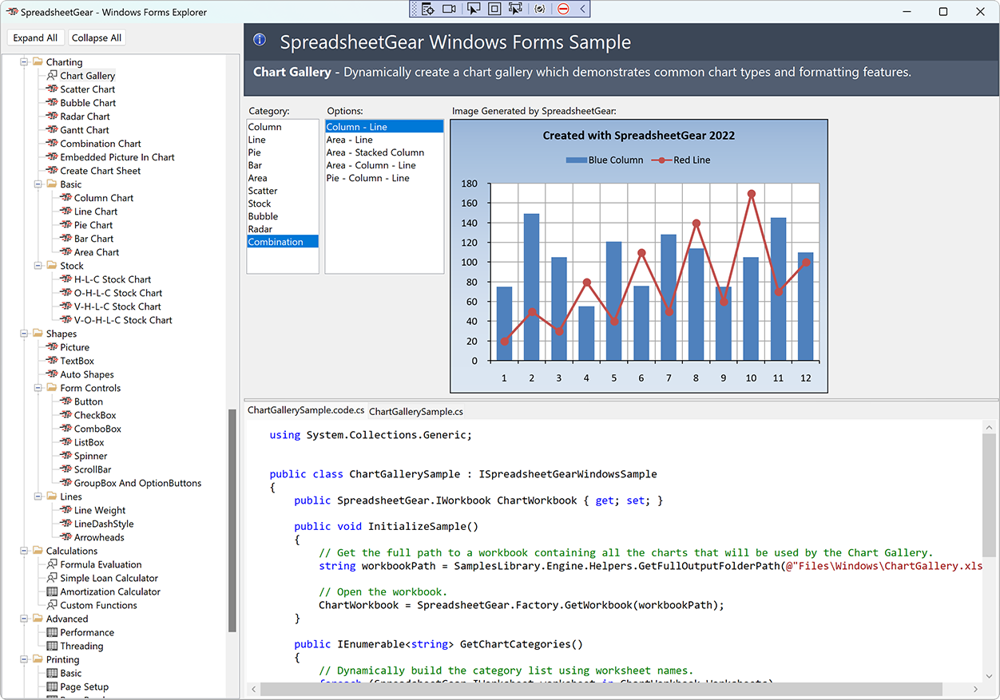
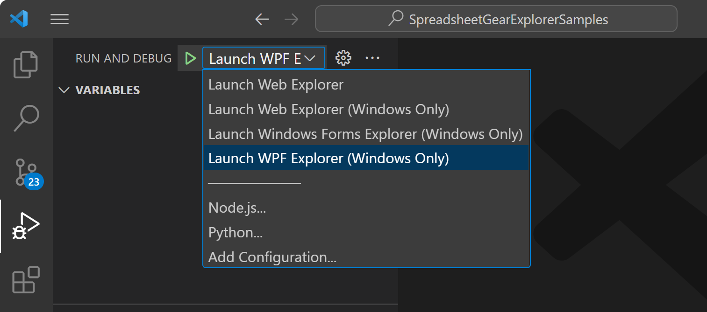

#  SpreadsheetGear Explorer Samples
This repository contains samples demonstrating many features available in the following products:

  - [SpreadsheetGear Engine for .NET](#sg-eng)
  - [SpreadsheetGear for Windows](#sg-win)

Product features demonstrated include:

<ul>
  <li>
    Cell Formatting
    <ul style="columns: 3;">
      <li>Fonts</li>
      <li>Borders</li>
      <li>Interior</li>
      <li>Orientation</li>
      <li>Hyperlinks</li>
      <li>Validation</li>
      <li>Cell Comments</li>
      <li>Number Formats</li>
      <li>Conditional Formatting</li>
    </ul>
  </li>
  <li>
    Range Operations
    <ul style="columns: 3;">
      <li>Auto-Filters</li>
      <li>Cell Protection</li>
      <li>Group and Outline</li>
      <li>Sorting</li>
      <li>Merge Cells</li>
      <li>Fill Data Series</li>
    </ul>
  </li>
  <li>Cell Formulas, Calculations and Values</li>
  <li>
    Worksheet features
    <ul style="columns: 3;">
      <li>Evaluating Ranges and Values from Formulas</li>
      <li>Sheet Tab Colors</li>
      <li>Named Ranges</li>
      <li>Sheet Visibility</li>
      <li>Move and Copy Sheets</li>
      <li>Display Options</li>
    </ul>
  </li>
  <li>Workbook features
    <ul style="columns: 2;">
      <li>Reading and Writing Workbook Files from Disk, Stream or Byte Array</li>
      <li>Workbook Encryption</li>
      <li>Cell Styles</li>
      <li>Protecting Workbook Structures and Windows</li>
      <li>Sheet Management (Add, Move, Copy, Delete Sheets)</li>
      <li>Workbook and Worksheet "Window Info"</li>
      <li>Built-In and Custom Document Properties</li>
      <li>DateTimes and Serial Numeric Dates</li>
    </ul>
  </li>
  <li>
    Charting Features
    <ul style="columns: 2;">
      <li>Chart Types (Column, Line, Pie, Bar, Area, Stock, Scatter, Bubble, Radar, Gantt and Combination)</li>
      <li>Embedding Pictures in Charts</li>
      <li>Creating Chart Sheets</li>
    </ul>
  </li>
  <li>
    Shape Features
    <ul style="columns: 3;">
      <li>Form Controls (Button, CheckBox, ComboBox, ListBox, Spinner, ScrollBar, GroupBox and OptionButton)</li>
      <li>Lines (with Weight, Dash Style and Arrowhead options)</li>
      <li>Pictures</li>
      <li>TextBoxes</li>
      <li>AutoShapes</li>
    </ul>
  </li>
  <li>
    Printing Features
    <ul style="columns: 3;">
      <li>Headers and Footers</li>
      <li>Zoom and FitToPages</li>
      <li>PrintArea</li>
      <li>PrintTitles</li>
      <li>Orientation</li>
      <li>Manual Page Breaks</li>
    </ul>
  </li>
  <li>
    Image Rendering and WPF & WinForms Controls (<b>Windows Only</b>)
    <ul style="columns: 2;">
      <li>Interactive WorkbookView and FormulaBar controls for Windows Forms and WPF</li>
      <li>High DPI image rendering of Ranges, Charts and other Shapes</li>
      <li>WorkbookDesigner dialog and "Explorer" dialogs to modify various aspects of a workbook such as worksheets, ranges, charts, shapes, etc.</li>
    </ul>
  </li>
</ul>

## SpreadsheetGear Products and Supported Platforms

###  SpreadsheetGear Engine for .NET
*SpreadsheetGear Engine for .NET* provides a core set of APIs to read, write, manipulate and calculate workbooks, build charts, format worksheets and cells, and more.   

This product targets both .NET 6 (`net6.0`) and .NET Standard 2.0 (`netstandard2.0`), providing a wide array of supported platforms and OS including:
  - .NET Core 2.0 - .NET 6+
  - .NET Framework 4.6.2+
  - Windows
  - MacOS
  - Linux
  - Mono
  - Xamarin (iOS, Android, etc.)
  

###  SpreadsheetGear for Windows
Builds on the capabilities of *SpreadsheetGear Engine for .NET* to add powerful Excel-compatible image rendering, viewing, editing, formatting, calculating, filtering, sorting, charting, printing and more to your Windows Forms and WPF applications with the easy-to-use WorkbookView and FormulaBar controls.  

*SpreadsheetGear for Windows* targets .NET 6 for Windows (`net6.0-windows`).  This product includes a license to also use *SpreadsheetGear Engine for .NET*.

Learn more about these products on our [Features Page](https://www.spreadsheetgear.com/Products/Features) and more details on their differences on our [Comparison Page](https://www.spreadsheetgear.com/Products/Compare).

## Sample Projects

There are 3 executable Visual Studio Projects (\*.csproj) in this repository, pictured and described in more detail below.  These projects work with Visual Studio 2022, Visual Studio Code (VSCode) and Visual Studio for Mac.  See the [Running the Samples](#section-running-the-samples) section for more details on running these projects in your preferred IDE.  

### Web Explorer Samples

The Web Explorer presents *SpreadsheetGear Engine for .NET* samples using an ASP.NET Core Web App.  Note this VS Project targets both `net6.0` and `net6.0-windows`:
  - `net6.0`: Use this target framework to run the samples on a wide variety of platforms such as Windows, MacOS and Linux. Most samples provide an option to download an Excel workbook file with the results of the sample.
  - `net6.0-windows`: Use this target framework when running on Windows to provide an additional option to render an image of many of sample results.  Image rendering is accomplished by utilizing the *SpreadsheetGear for Windows* product, which has a `SpreadsheetGear.Drawing.Image` class that renders images of ranges, charts and other shapes.  For more samples that demonstrate this `Image` class please see our website's [Excel Chart and Range Imaging Razor Pages Samples](https://www.spreadsheetgear.com/Support/Samples/RazorPages/Category/Imaging).

### WPF Explorer Samples

The WPF Explorer presents samples applicable to both the *SpreadsheetGear Engine for .NET* and *SpreadsheetGear for Windows* products in the context of a WPF Desktop App, where the WPF WorkbookView and FormulaBar controls are utilized to provide an interactive Excel-like experience when presenting the results of a given sample.  

These samples target `net6.0-windows` and so require running on Windows with the *SpreadsheetGear for Windows* product.

### Windows Forms Explorer Samples

The Windows Forms Explorer presents samples applicable to both the *SpreadsheetGear Engine for .NET* and *SpreadsheetGear for Windows* products in the context of a Windows Forms Desktop App, where the Windows Forms WorkbookView and FormulaBar controls are utilized to provide an interactive Excel-like experience when presenting the results of a given sample.  

These samples target `net6.0-windows` and so require running on Windows with the *SpreadsheetGear for Windows* product.

## Running the Samples
Depending on your development environment, you can access the samples in a variety of ways using Visual Studio 2022, Visual Studio Code (VSCode) and Visual Studio for Mac.

### Visual Studio 2022
Three Visual Studio Solutions (\*.sln) are provided in the repository root folder to use with Visual Studio 2022.  Below is a list of the "Explorer" Visual Studio Projects that are included in each of the Solutions:

 - **SpreadsheetGearExplorerSamples.sln** (Requires the "ASP.NET and web development" and ".NET desktop development" workloads)
   - **Web Explorer Samples**
   - **WPF Explorer Samples**
   - **Windows Forms Explorer Samples**

 - **SpreadsheetGearExplorerSamples_Windows.sln** (Requires the ".NET desktop development" workload)
   - **WPF Explorer Samples**
   - **Windows Forms Explorer Samples**

 - **SpreadsheetGearExplorerSamples_Web.sln** - (Requires the "ASP.NET and web development" workload)
   - **Web Explorer Samples**

### Visual Studio for Mac
Please use the **SpreadsheetGearExplorerSamples_Web.sln** in the repository root folder to access the **Web Explorer Samples**.  The other 2 Solutions include Windows-only VS Projects that utilize the *SpreadsheetGear for Windows* product, which is not supported on a Mac.

### Visual Studio Code
Visual Studio Code (VSCode) is a cross-platform code editor, supported on Windows, MacOS and Linux; however, keep in mind that some of the SpreadsheetGear Explorer Samples run only on Windows:
  - **Web Explorer Samples** - Windows, MacOS, Linux
  - **WPF Explorer Samples** - Windows Only
  - **Windows Forms Explorer Samples** - Windows Only

To run applicable samples with Visual Studio Code, please also install the [.NET 6.0 SDK](https://dotnet.microsoft.com/en-us/download) and the [Microsoft C# Extension](https://marketplace.visualstudio.com/items?itemName=ms-dotnettools.csharp) for Visual Studio Code.  After cloning the repo, open the root `SpreadsheetGearExplorerSamples` folder in VSCode and build & launch any of the above Explorer sample projects from the *Run and Debug* Side Bar.

> If you are on MacOS or Linux, the WPF and Windows Forms Explorer samples will not be runnable, nor will the version of the WebExplorer samples that depend on Windows to render images.  The "Web Explorer" samples are runnable from MacOS and Linux.

The below individual folders can also be opened in VSCode, and relevant options will be provided to build & run the samples:
  - SpreadsheetGearExplorerSamples/WebExplorer
  - SpreadsheetGearExplorerSamples/WPFExplorer
  - SpreadsheetGearExplorerSamples/WindowsFormsExplorer

These folders also contain `*.code-workspace` files that you can open in VSCode (instead of opening the folder) if you would like to have all dependent projects included when viewing VSCode's Explorer Side Bar