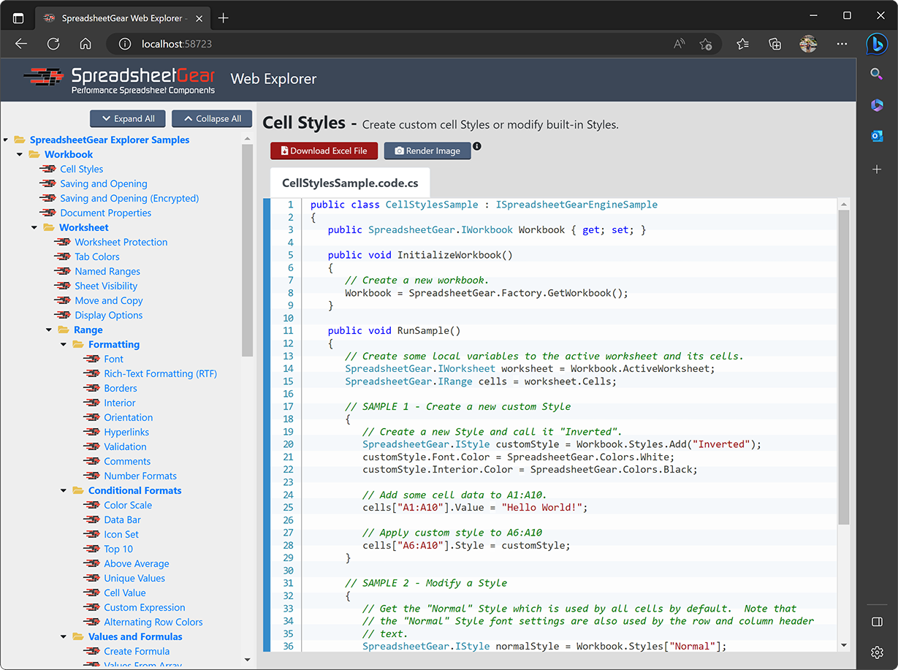

#  Web Explorer Samples

The Web Explorer presents *SpreadsheetGear Engine for .NET* samples using an ASP.NET Core Web App.  Note this VS Project targets both `net6.0` and `net6.0-windows`:
  - `net6.0`: Use this target framework to run the samples on a wide variety of platforms such as Windows, MacOS and Linux. Most samples provide an option to download an Excel workbook file with the results of the sample.
  - `net6.0-windows`: Use this target framework when running on Windows to provide an additional option to render an image of many of sample results.  Image rendering is accomplished by utilizing the *SpreadsheetGear for Windows* product, which has a `SpreadsheetGear.Drawing.Image` class that renders images of ranges, charts and other shapes.  For more samples that demonstrate this `Image` class please see our website's [Excel Chart and Range Imaging Razor Pages Samples](https://www.spreadsheetgear.com/Support/Samples/RazorPages/Category/Imaging).

## Running the Samples
Depending on your development environment, you can access the samples in a variety of ways using Visual Studio 2022, Visual Studio Code (VSCode) and Visual Studio for Mac.

Please see the <a href="../README.md#section-running-the-samples">Running the Samples</a> section in this GitHub repository's main README.md for instructions on running this sample project.