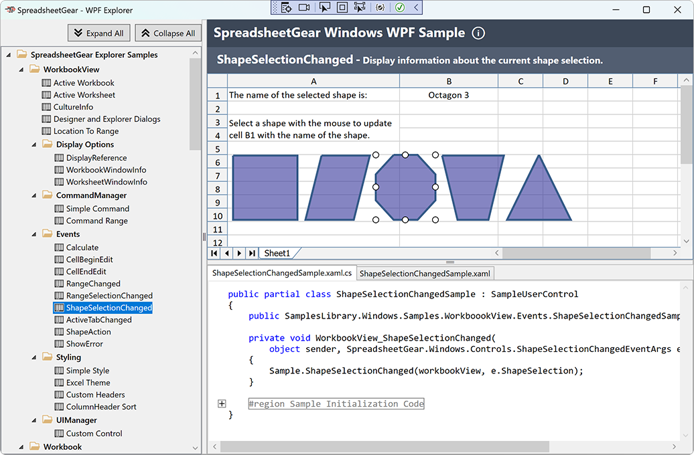

#  WPF Explorer Samples

The WPF Explorer presents samples applicable to both the *SpreadsheetGear Engine for .NET* and *SpreadsheetGear for Windows* products in the context of a WPF Desktop App, where the WPF WorkbookView and FormulaBar controls are utilized to provide an interactive Excel-like experience when presenting the results of a given sample.  

These samples target `net6.0-windows` and so require running on Windows with the *SpreadsheetGear for Windows* product.

## Running the Samples
You can access the samples using either Visual Studio 2022 or Visual Studio Code (VSCode) on Windows.

Please see the <a href="../README.md#section-running-the-samples">Running the Samples</a> section in this GitHub repository's main README.md for instructions on running this sample project.